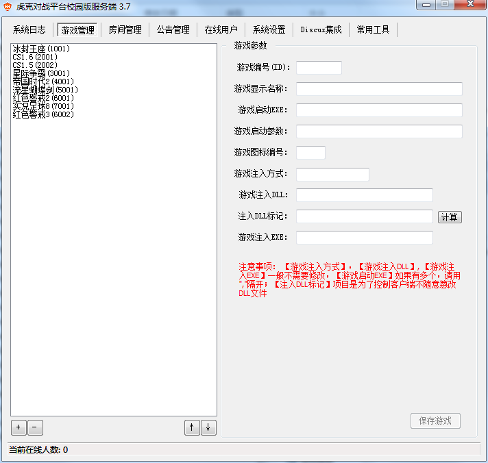
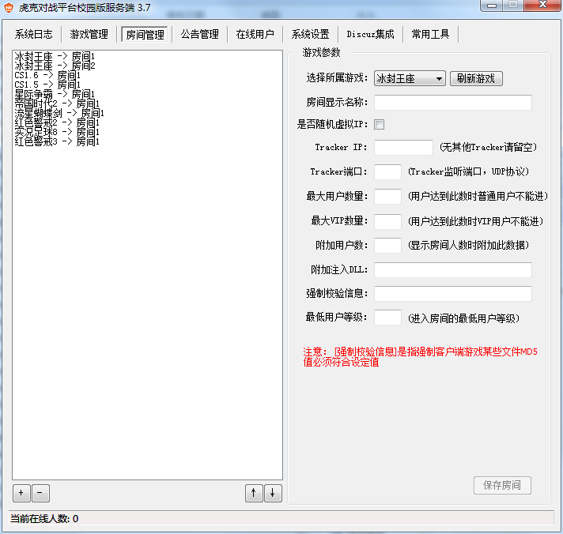
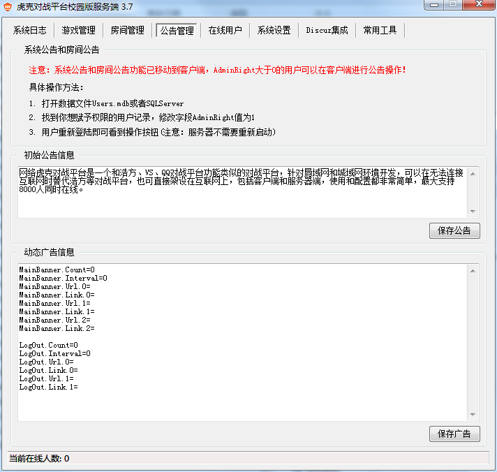
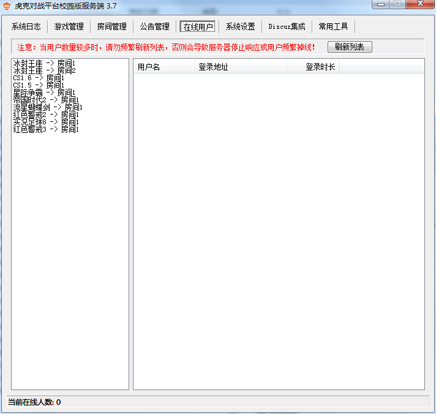
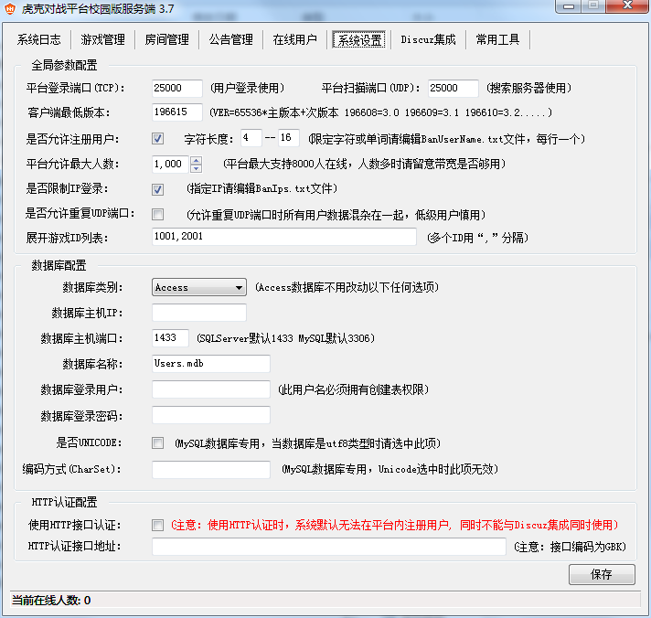
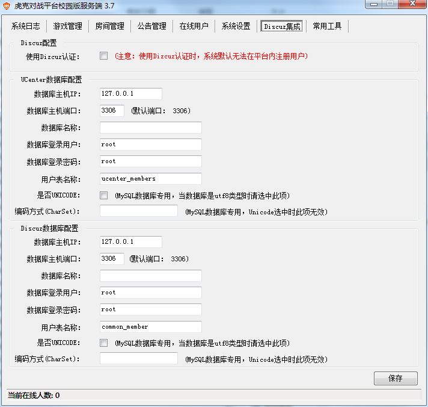
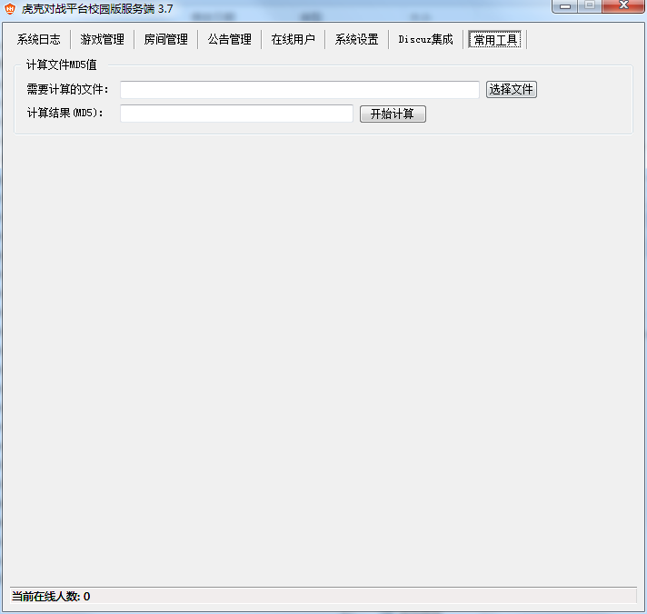
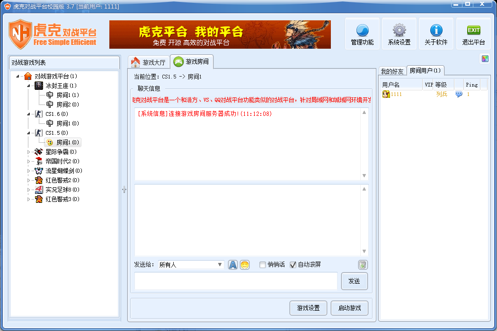

# 虎克对战平台简介

NetHook API 对战平台内核库是一套实现时下流行的网络对战平台(如浩方、VS)同样功能的通用内核库，运行效率高，使用极为简单。内核库提供了标准的C语言API接口, 可以被VC, Delphi, VB, C# 等开发环境轻松调用。（注意：内核库仅供开发人员使用，普通用户请用校园版）。

虎克对战平台校园版是基于NetHOOK API开发的一套非常简洁、高效的免费对战平台，包含客户端和服务器，并且客户端是开源项目，大家可以使用此平台轻松搭建属于自己的对战平台。

NetEngineDLL.dll是基于Window完成端口模型设计的TCPServer和UDPSever通用模块，简单，高效，稳定，任何编程语言都可以调用。虎克对战校园版服务端基于此模块开发，并发数可以达到6w+，任何人都可以免费使用。

NetHook API 对战平台内核库目前为免费版本，但用于商业用途请与我们联系。

官方微博为：[http://t.qq.com/nethook](http://t.qq.com/nethook)    架设帮助网站：[http://hi.baidu.com/nethook963/home](http://hi.baidu.com/nethook963/home)

# 最新进展

```
2012-11-09：发布Ver3.7版本，主要增加服务端安全性及若干界面软件小问题。
2012-03-16：发布Ver3.6版本，主要增加游戏内置公告、聊天表情、彻底解决掉线问题
2012-01-01：发布Ver3.5版本，主要修复皮肤导致死机和增加服务端稳定性，发布NetEngineDLL.dll通用模块
2011-04-28：发布Ver3.4版本，主要修复客户端断线、增加好友及更换皮肤
2011-03-24：发布Ver3.3版本，主要修复魔兽房间显示延迟和游戏过程中卡的问题
2011-02-18：发布Ver3.2版本，主要增加对MySQL数据库支持、Discuz集成以及自动更新游戏版本功能
2011-01-18：发布Ver3.1版本，主要增加对魔兽争霸的相关优化
2011-01-10：发布Ver3.0版本，全新改版，支持多房间，SQLSERVER数据库(注意：完全不兼容以前版本)
```

# 更新日志

[Update3.x](./docs/Update3.x.txt "Update3")

# 文件下载

[NetHookAPI及Demo](./package/NetHookApi.rar "NetHookApi")     

校园版下载

[Ver3.7客户端](./package/NetHookClient3.7.rar "NetHookClient3.7") 

[Ver3.7服务端](./package/NetHookServer3.7.rar "NetHookServer3.7")

[Ver3.4客户端源代码](./package/Source3.4.rar "Source3.4")

更多下载

[Download](http://www.net963.com/Download/)

# windows 主机假设教程

[windows部署教程](./docs/windows_install_zh.md "windows_install")

[平台接入discuz](./docs/mysql_discuz_zh.md "mysql_discuz")

[客户端自动更新](./docs/script_zh.md "script")

[服务端分布式](./docs/Distributed_zh.md "Distributed")

# 管理权限说明
服务端和客户端更新了权限管理功能，权限管理改成了自由组合模式 数据库AdminRight字段。

```
ID        VipLevel        AdminRight
1        VIP等级1        踢出用户
2        VIP等级2        发送广播，无踢出权限
3        VIP等级3        踢出用户，发送广播
4        VIP等级4        加入VIP会员，无踢出，无广播权限
5        VIP等级5        踢出用户，加入VIP
6        VIP等级6        无踢人，广播，加入VIP
7        红色字体        广播，踢出，VIP
8        红色字体        限制IP地址
9        红色字体        踢出，限制IP
10        红色字体        广播，限制IP
11        右侧箭头        广播，踢用户，限制IP
12        人物图标        限制IP,加入VIP
13        红色字体        踢出，限制IP,加入VIP
14        红色字体        广播，限制IP，加入VIP
15        红色字体        广播，踢出，限制IP，加入VIP

```

权限可加法累加如：

```
3 踢人和广播
14 广播与增加vip和禁止IP
```

# 用户等级权限

```
LevelID         LevelName        OnlineTime
1        新兵        60
2        列兵        180
3        班长        540
4        排长        1920
5        连长        4500
6        营长        8640
7        团长        14700
8        旅长        23040
9        师长        34020
10        军长        48000
11        指挥官        65340
12        司令官        86400
13        总理        111540
14        主席        141120
```

# 客户端动态广告设置

```
#Banner广告总数
MainBanner.Count=3
#广告跳转时间默认单位ss
MainBanner.Interval=10
#第一个广告图片地址
MainBanner.Url.0=http://192.168.2.101/Banner1.gif
#相应的第一个广告的url外部链接
MainBanner.Link.0=https://www.baidu.com/
#第二个广告图片
MainBanner.Url.1=http://192.168.2.101/Banner2.gif
#第二个广告链接
MainBanner.Link.1=https://www.sohu.com/
MainBanner.Url.2=http://192.168.2.101/Banner3.gif
MainBanner.Link.2=http://www.sina.com.cn/

#退出logout广告同理。
LogOut.Count=0
LogOut.Interval=0
LogOut.Url.0=
LogOut.Link.0=
LogOut.Url.1=
LogOut.Link.1=
```

# FAQ

[常见问题](./docs/faq.md "faq")

# 软件截图

服务端截图










客户端截图




# 联系方式

* QQ群：222670265  作者QQ:12286195

# 如果可以帮到你什么忙，欢迎打赏~
## wechat(微信)

