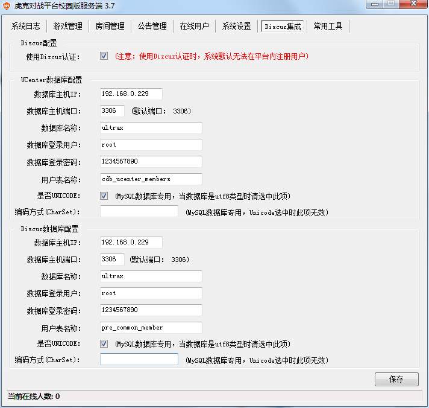
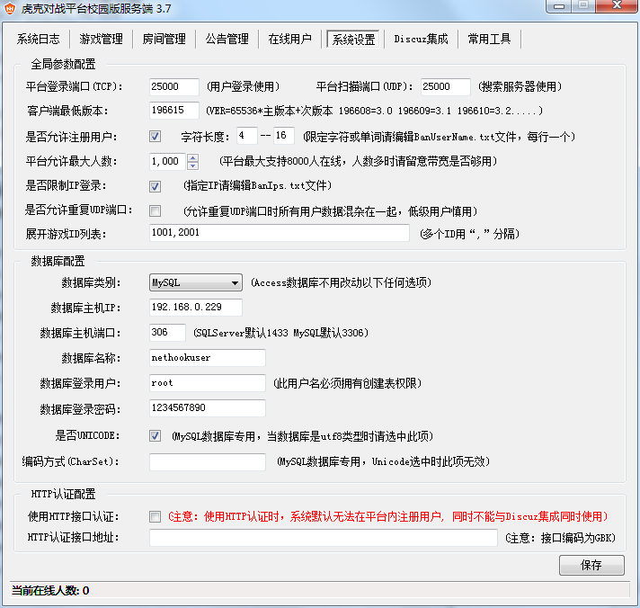

# nethook 3.7 集成 discuz x2.5

## 环境

linux 环境 MYSQL 数据库 （UTF-8）

discuz UCenter IP 地址 192.168.0.229

NETHOOK SERVER 服务器 IP 192.168.0.88

NETHOOK 客户端 IP 192.168.0.100



* 使用DISCUZ 整合后是无法再本平台注册用户的，需要在你的UCHOME 中去注册。
* 修改服务端config.ini "RegUrl=" 后的链接改为你discuz 注册页面。

## nethook 数据库使用 mysql



* 数据库新建nethookuser库 utf8_general_ci（避免大小写敏感）
* 导入库文件NetHookUser(MySQL).sql

* mysql 数据库授权

第一个用户 （赋有创建表权限）
将 nethookuser 数据库的所有权限授权给 root 这个用户，允许 root 用户在 192.168.0.88 这个 IP 进行远程登陆，并设置 root 用户的密码为 1234567890 。

```
grant all PRIVILEGES on nethookuser.* to root@'192.168.0.88' identified by '1234567890';
flush privileges;
```

第二个用户 （只可读取权限即可用来访问 DISCUZ UCenter 数据库）
```
grant all PRIVILEGES on ultrax.* to root@'192.168.0.88' identified by '1234567890';
flush privileges;
```
