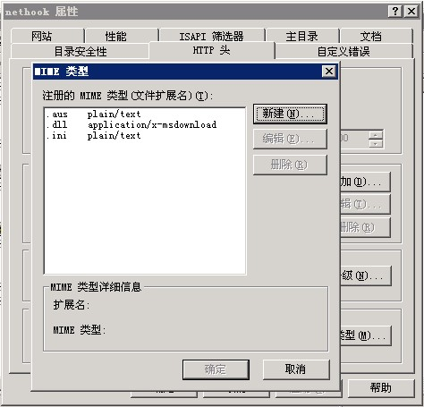

# windows iis 自动更新



* 再配置IIS 的http头选项中添加 MIME 类型

```
扩展名 .ini
类型   plain/te


扩展名 .aus
类型  plain/text

扩展名 .dll
类型 application/x-msdownload
```

## 升级脚本示例子

```
;=====================
; 自动升级脚本 (示例)
;=====================

;所有以分号为第一个字符开始的行都被脚本执行器忽略；
;请勿在脚本中使用TAB键，否则在Win98下会出问题；

;定义脚本中要用到的宏
[MACRO]
BASEURL=http://www.net963.com/Download/
UPGRADE=$(APP)Upgrade\

;升级成功后要启动的程序
[RUN]
RUN=$(APP)NetHookClient.exe

;VERSION 升级后可到达的版本
;SUPPORT 支持升级的版本(用逗号隔开)
[VERSION]
VERSION=3.1
SUPPORT=3.0

;首先下载文件，如果有任何文件下载错误则放弃更新
[DOWNLOAD]
1 GET=$(BASEURL)NetHookServer2.3.rar,          $(UPGRADE)NetHookServer2.3.rar
2 GET=$(BASEURL)NetHookServer2.4.rar,             $(UPGRADE)NetHookServer2.4.rar

;升级文件下载完整后，开始执行升级动作
;EXECUTE 执行指定的文件
;REPLACE 替换指定的文件，如果没有就新增
;ADD     增加一个文件，如果有则放弃
;DELETE  删除指定的文件

[ACTION]
1 REPLACE=$(UPGRADE)NetHookServer2.3.rar,      $(APP)NetHookServer2.3.rar
2 REPLACE=$(UPGRADE)NetHookServer2.4.rar,   $(APP)NetHookServer2.4.rar
```