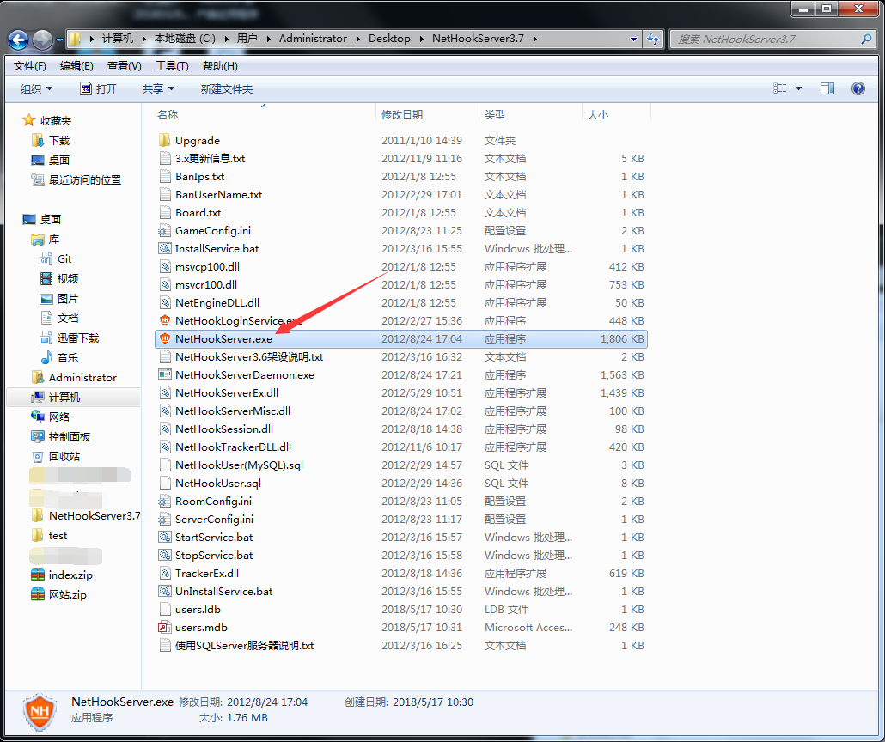
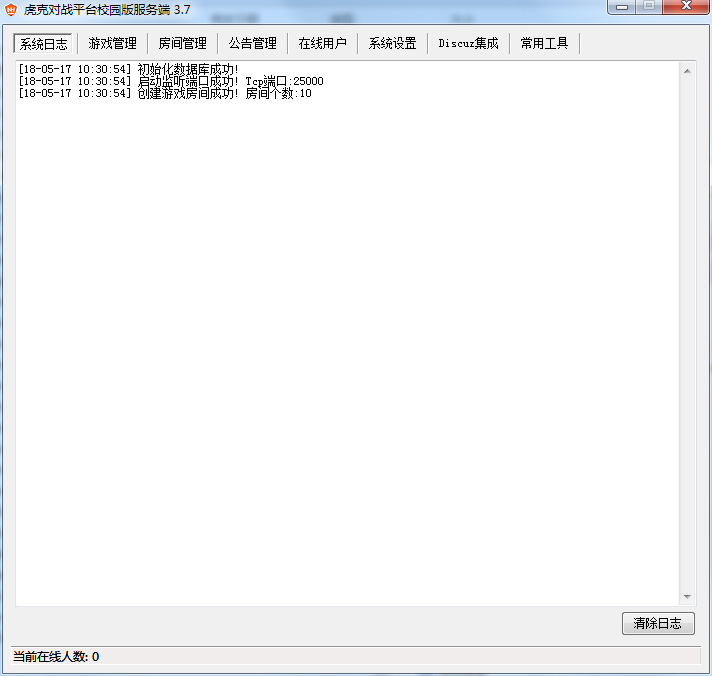
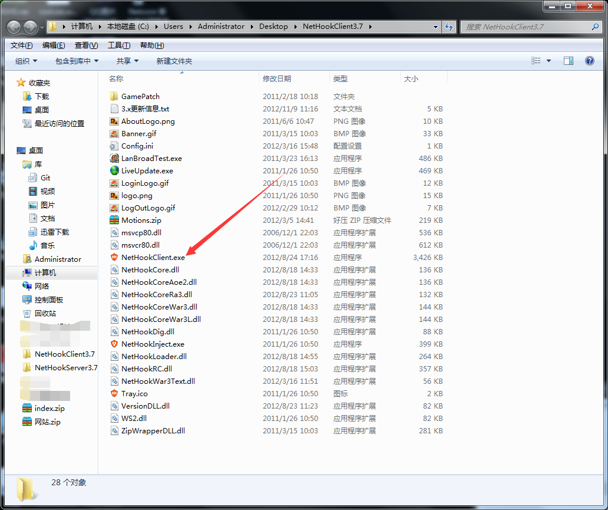
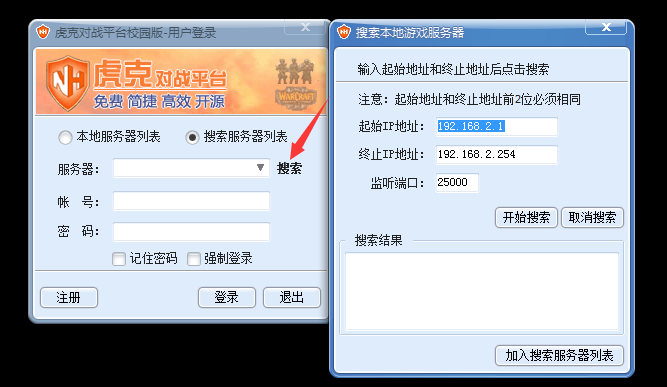
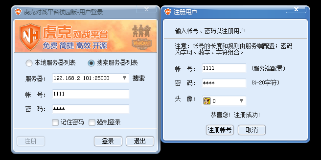
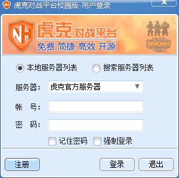

# 服务端假设

1. 关闭本机防火墙。

2. 解压 “NetHookServer3.7.rar” 服务端文件夹，打开 “NetHookServer.exe” 。





3. 确认本机IP地址192.168.2.101

# 客户端链接



找该文件夹下的 “config.txt” 文件打开
编辑如下字段：

```
UserServerCount=1
UserServerName_0=（服务器名称任意填写）
UserServerIp_0=192.168.2.101（服务器IP地址）
UserServerPort_0=25000（端口）
NetServerCount=1
NetServerName_0=虎克官方服务器（同上）
NetServerIp_0=（同上）
NetServerPort_0=25000（同上）
```

或搜索同局域网



第一的登录平台的 将会是最高权限！超级管理员





